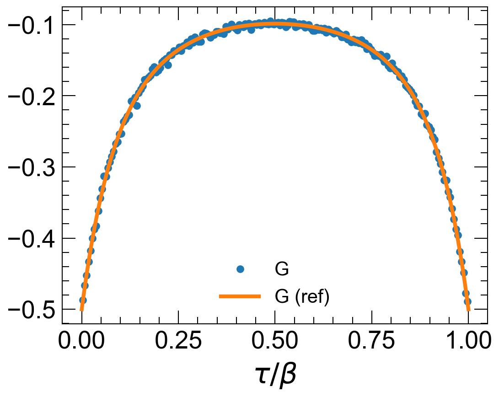

# tinycthyb

This is tinycthyb. A _tiny_ CT-QMC base on the hybridization expansion algorithm. Full disclaimer, this is C++ implementation based entirely on another educational implementation [example](https://github.com/HugoStrand/cthyb.jl). This was an educational exercise for myself to learn more about the CT-QMC algorithm as well as C++.

## CT-HYB
A few words on the algorithm. More details [here](https://journals.aps.org/rmp/abstract/10.1103/RevModPhys.83.349).

## Build
To build the project (after installing the dependencies),

1. ``git clone https://github.com/harrisonlabollita/tinycthyb.git``
2. ``cd tinycthyb``
3. ``mkdir build && cd build``
4. ``cmake ../src``
5. ``make``

## Example

